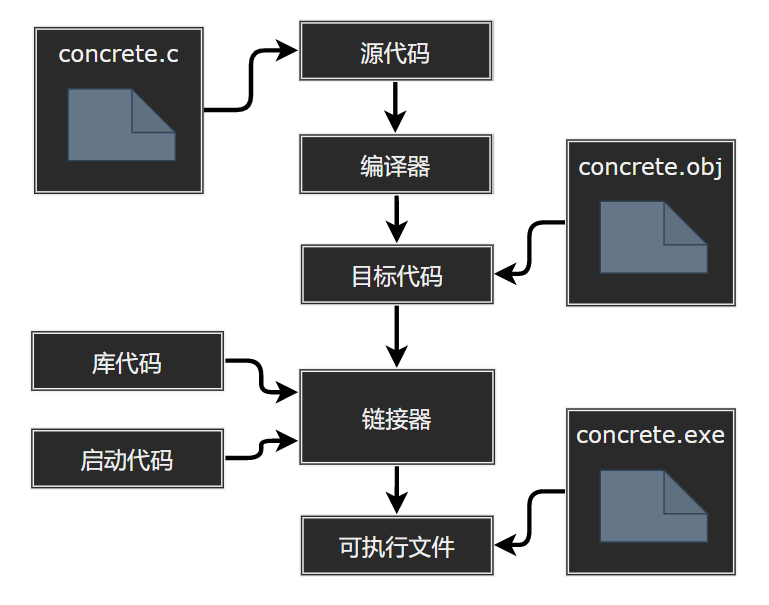
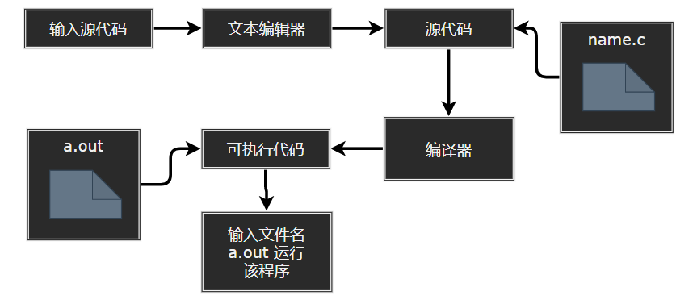

# C 语言的起源与编程机制

- C 的历史和特性
- 编写程序的步骤
- 编译器和链接器的一些知识
- C 标准
  
---
- [C 语言的起源与编程机制](#c-语言的起源与编程机制)
  - [1. C Plus 起源](#1-c-plus-起源)
  - [2. C Plus 设计特性](#2-c-plus-设计特性)
  - [3. 使用 C 语言的7个步骤](#3-使用-c-语言的7个步骤)
  - [4. 编程机制](#4-编程机制)
    - [4.1 目标代码文件、可执行文件和库](#41-目标代码文件可执行文件和库)
    - [4.2 UNIX 系统](#42-unix-系统)
    - [4.3 GNU 编译器集合](#43-gnu-编译器集合)
    - [4.4 Linux 系统](#44-linux-系统)
    - [4.5 PC 的命令行编译器](#45-pc-的命令行编译器)
    - [4.6 集成开发环境（windows）](#46-集成开发环境windows)

---
## 1. C Plus 起源

- 1972 年自贝尔实验室开发 UNIX 操作系统时设计了 C 语言，设计初衷是将其作为程序员使用的一种编程工具。

---
## 2. C Plus 设计特性

- 结构化：C 语言的设计理念让用户能轻松地完成自顶向下的规划、结构化编程和模块化设计。
  
- 高效性：C 语言具有通常是汇编语言才具有的微调控制能力，可以根据具体情况微调程序以获得最大运行速度或最有效地使用内存。

- 可移植性：在一种系统中编写的 C 程序稍作修改或不修改就能在其他系统运行，这得益于 C 语言与 UNIX 系统的良好兼容性。

---
## 3. 使用 C 语言的7个步骤

1. 定义程序的目标：想要程序去做什么首先自己要明确自己想做什么，思考你的程序需要哪些信息，要进行哪些计算和控制，以及程序应该要报告什么信息。

2. 设计程序：要决定在程序（还可能是辅助文件）中如何表示数据，以及用什么方法处理数据；应该用一般术语来描述问题，而不是用具体的代码。

3. 编写代码：设计好程序后，就可以编写代码来实现它。也就是说，把你设计的程序翻译成 C 语言。

4. 编译：编译器是把源代码转换成可执行代码的程序，可执行代码是用计算机的机器语言表示的代码。这种语言由数字码表示的指令组成。其结果是，生成一个用户可以运行的可执行文件，其中包含着计算机能理解的代码。

5. 运行程序：可执行文件是可运行的程序。在常见环境（ 包括 Windows 命令提示符模式、UNIX 终端模式和 Linux 终端模式）中运行程序要输入可执行文件的文件名。

6. 测试与调试程序：检查程序是否按照你所设计的思路运行，查找并修复程序错误的过程叫调试。

7. 维护与修改代码：创建完程序后，你发现程序有错，或者想扩展程序的用途，这时就要修改程序。

---
## 4. 编程机制

- 用C语言编写程序时，编写的内容被储存在文本文件中，该文件被称为源代码文件（source code file）

- 以 *.c 结尾，根据操作系统的不同，允许的文件基本名长度不同（Linux，Win 和 Mac 都允许使用长文件名）

---
### 4.1 目标代码文件、可执行文件和库

- C 编程的基本策略是，用程序把源代码文件转换为可执行文件（其中包含可直接运行的机器语言代码）

- 编译器把源代码转换成中间代码，链接器把中间代码和其他代码合并，生成可执行文件。

- C 使用这种分而治之的方法方便对程序进行模块化，可以独立编译单独的模块，稍后再用链接器合并已编译的模块。通过这种方式，如果只更改某个模块，不必因此重新编译其他模块。

> 目标代码文件

- 把源代码转换为机器语言代码，并把结果放在目标代码文件，但是并不能直接运行该文件。

- 目标代码文件缺失启动代码（startup code）。启动代码充当着程序和操作系统之间的接口。

> 库文件

- 目标代码还缺少库函数，几乎所有的C程序都要使用C标准库中的函数。

- C 编译器会创建一个与源代码基本名相同的目标代码文件，其拓展名为 *.o ，当生成完整的可执行程序，一般会将其删除。

- concrete.c 中就使用了 printf() 函数。目标代码文件并不包含该函数的代码，它只包含了使用 printf() 函数的指令。printf() 函数真正的代码储存在另一个被称为库的文件中。库文件中有许多函数的目标代码。

> 可执行文件

- 链接器的作用是，把你编写的目标代码、系统的标准启动代码和库代码这 3 部分合并成一个文件，即可执行文件。

  

- 目标文件和可执行文件都由机器语言指令组成的。

---
### 4.2 UNIX 系统

> 用 UNIX 准备 C 程序

  

---
### 4.3 GNU 编译器集合

- GNU 项目始于1987年，是一个开发大量免费 UNIX 软件的集合。

- GCC 有各种版本以适应不同的硬件平台和操作系统，包括 UNIX、Linux 和 Windows。用 gcc 命令便可调用 GCC C 编译器（cc 可作为 gcc 别名）。

---
### 4.4 Linux 系统

- Linux 是一个开源、流行、类似于 UNIX 的操作系统，可在不同平台（包括 PC 和 Mac）上运行。

- 在 Linux 中准备 C 程序与在 UNIX 系统中几乎一样，不同的是要使用 GNU 提供的 GCC 公共域 C 编译器。

---
### 4.5 PC 的命令行编译器

- C 编译器不是标准 Windows 软件包的一部分，因此需要从别处获取并安装 C 编译器。可以从互联网免费下载 Cygwin 和 MinGW，这样便可在 PC 上通过命令行使用 GCC 编译器。

---
### 4.6 集成开发环境（windows）

- 常见 IDE：Microsoft Visual Studio Express 和 Pelles C。

---