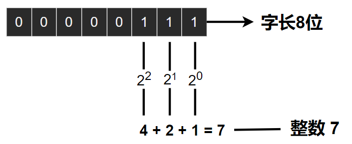

# C Plus 数据与C

---
- [C Plus 数据与C](#c-plus-数据与c)
  - [1. 变量与常量](#1-变量与常量)
  - [2. 数据: 数据类型关键字](#2-数据-数据类型关键字)
    - [2.1 整数和浮点数](#21-整数和浮点数)
    - [2.2 整数](#22-整数)
    - [2.3 浮点数](#23-浮点数)
  - [3. C语言的基本数据类型](#3-c语言的基本数据类型)
    - [3.1 int 类型](#31-int-类型)
    - [3.2 其他整数类型](#32-其他整数类型)
    - [3.3 char 类型](#33-char-类型)
    - [3.4 _Bool 类型](#34-_bool-类型)
    - [3.5 可移植类型：stdint.h](#35-可移植类型stdinth)
    - [3.6 可移植类型：inttypes.h](#36-可移植类型inttypesh)
    - [3.7 float、double和long double](#37-floatdouble和long-double)
    - [3.8 复数与虚数类型](#38-复数与虚数类型)
    - [3.9 其他类型](#39-其他类型)
    - [3.10 类型大小 sizeof()](#310-类型大小-sizeof)
  - [4. 参数和陷阱](#4-参数和陷阱)

---
## 1. 变量与常量

- 在整个程序的运行过程中没有变化，这些称为常量（constant）
- 其他数据类型在程序运行期间可能会改变或被赋值，这些称为变量（variable）

---
## 2. 数据: 数据类型关键字

```C
    // 初始 K&R 关键字
    int, long, short, unsigned, char, float, double
    // C90 新增
    signed, void
    // C99 新增
    _Bool(布尔值), _Complex(复数), _Imaginary(虚数)
```

- C 语言中，int 表示基本的整数类型。
- long、short、unsigned、signed 提供基本整型的变式。
- 通过这些关键字创建的类型，按计算机的储存方式可分为两大基本类型：整数类型和浮点数类型。

> 位、字节和字

- 位、字节和字是描述计算机数据单元或存储单元的术语。这里主要指存储单元。
- 最小的存储单元是位（bit），可以储存0或1。位是计算机内存的基本构建块。
- 字节（byte）是常用的计算机存储单位。1字节均为8位。
- 字（word）是设计计算机时给定的自然存储单位。计算机的字长越大，其数据转移越快，允许的内存访问也更多。

---
### 2.1 整数和浮点数

- 对我们而言，整数和浮点数的区别是它们的书写方式不同。对计算机而言，它们的区别是储存方式不同。

---
### 2.2 整数

- 计算机以二进制数字存储整数

  

---
### 2.3 浮点数

- 浮点数和整数的储存方案不同。整数没有小数部分，浮点数有小数部分。
- 计算机把浮点数分成小数部分和指数部分来表示，而且分开储存这两部分。

- 对于浮点数 3.14159，以浮点格式（十进制）储存：

```
  | + | .314159 | 1 |
    |      |      |
   符号   小数   指数
```

- 浮点数可以表示的范围比整数大，但浮点数算数运算过程中可能存在精度损失。

---
## 3. C语言的基本数据类型

### 3.1 int 类型

- int类型是有符号整型，即int类型的值必须是整数，可以是正整数、负整数或零。
- ISO C规定int的取值范围最小为-32768～32767。
  
```c
    int num;            // 创建内存空间
    int number = 1;     // 创建内存空间并为其赋值

    printf("%d",number);  // %d指明了在一行中打印整数的位置

    int num1 = 0123;      // 0 八进制前缀
    int num2 = 0xFFF;     // 0x/0X 十六进制前缀

    // 显示进制转换数字
    printf("%d");       // 显示十进制数字
    printf("%o");       // 以八进制显示数字
    printf("$x");       // 以十六进制显示数字

    // 显示进制数字前缀
    printf("%#o");      // %#o、%#x、%#X, 显示各进制数的前缀
```

> 以十进制、八进制、十六进制打印十进制数 100

```c
#include <stdio.h>
int main(void){
    int x = 100;
    printf("dec = %d; octal = %o; hex = %x\n", x, x, x);
    printf("dec = %d; octal = %#o; hex = %#x\n", x, x, x);
    return 0;
}      
/*
    dec = 100; octal = 144; hex = 64
    dec = 100; octal = 0144; hex = 0x64
*/
```

---
### 3.2 其他整数类型

- C语言提供3个附属关键字修饰基本整数类型：short、long 和 unsigned、signed
  - short 与 long 标识 int 的精度
  - signed 与 unsigned 标识 int 符号类型，signed 标识有符号（默认行为）
- C语言只规定了short占用的存储空间不能多于int，long占用的存储空间不能少于int。
- 现在，个人计算机上最常见的设置是，long long占64位，long占32位，short占16位，int占16位或32位

```c
    //short 
    short int num1;
    short num2;   //16bit

    //int
    signed int num1;
    int num2;     //16或32bit

    //long
    long int num1;
    long num2;    //32bit  L后缀

    //long long
    long long int num1;
    long long num2;   //C99  64bit  LL后缀

    //unsigned
    unsigned int num1;
    unsigned num2;    //U后缀
    unsigned short num_short;
    unsigned long num_long;    //UL后缀
```

> 打印 short、long、long long 和 unsigned类型

```
    %u    转换说明打印 unsigned int类型的值
    %ld   打印 long 类型的值
    %lx   表示以十六进制格式打印 long 类型整数
    %lo   表示以八进制格式打印 long 类型整数

    %h    转换说明打印 short 类型
    %hd   十进制显示 short 整数

    %lu   转换说明打印 unsigned long 类型
    %lld、%llu   表示 long long 类型的有符号与无符号类型
```

- 使用错误的转换说明会得到意想不到的结果，类型不同存在转换整数溢出的情况。

---
### 3.3 char 类型

- char 用于储存字符，技术层面本质是整数类型。
- 计算机使用数字编码来处理字符，用特定的整数表示特定的字符（常用编码 ASCII）。

```C
    char c1 = 'A';
    printf(c1+0); // 65  
```

> 转义序列

```
    \a      警报
    \b      退格
    \f      换页
    \n      换行
    \r      回车
    \t      水平制表符
    \v      垂直制表符
    \\      反斜杠
    \'      单引号
    \"      双引号
    \?      问号
    \0nn    八进制数
    \xhh    十六进制数
```

> 打印字符

```
    %c 指明待打印的字符，打印该整数值对应的字符
    %d 指明打印整数，转换说明打印 char 类型的值
```

> char 符号性

- 一些 C 编译器将 char 实现为有符号类型（-128 ~ 127），有些实现为无符号类型。
- 可以声明 signed 与 unsigned 指明 char 的符号，用来处理小整数。仅处理字符时无需任何修饰。

---
### 3.4 _Bool 类型

- C99标准添加 _Bool类型，表示布尔值；1 表示 true，0 表示 false。
- _Bool 类型实际上是一种整数类型，仅占用 1 bit。

---
### 3.5 可移植类型：stdint.h

- C99 新增了两个头文件stdint.h和inttypes.h，以确保C语言的类型在各系统中的功能相同。

- 在 stdint.h 头文件中，int32_t 表示32位的有符号整数类型
  - 在32位 int 的系统中，int32_t 作为 int 的别名
  - 在 int 为16位、long 为32位的系统会把 int32_t 作为 long 的别名
- 使用int32_t类型编写程序，并包含stdint.h头文件时，编译器会把int或long替换成与当前系统匹配的类型。

```c
//精确宽度整数类型
typedef signed char             int8_t;
typedef short                   int16_t;
typedef int                     int32_t;
typedef long long               int64_t;
typedef unsigned char           uint8_t;
typedef unsigned short          uint16_t;
typedef unsigned int            uint32_t;
typedef unsigned long long      uint64_t;

//至少有指定宽度的最小整数类型
typedef signed char             int_least8_t;
typedef short                   int_least16_t;
typedef int                     int_least32_t;
typedef long long               int_least64_t;
typedef unsigned char           uint_least8_t;
typedef unsigned short          uint_least16_t;
typedef unsigned int            uint_least32_t;
typedef unsigned long long      uint_least64_t;

//最快最小宽度类型
typedef signed char             int_fast8_t;
typedef int                     int_fast16_t;
typedef int                     int_fast32_t;
typedef long long               int_fast64_t;
typedef unsigned char           uint_fast8_t;
typedef unsigned int            uint_fast16_t;
typedef unsigned int            uint_fast32_t;
typedef unsigned long long      uint_fast64_t;

//系统的最大整数类型
typedef long long               intmax_t;
typedef unsigned long long      uintmax_t;
```

- int_least8_t是可容纳8位有符号整数值的类型中宽度最小的类型的一个别名。如果某系统的最小整数类型是16位，可能不会定义int8_t类型。该系统仍可使用int_least8_t类型，但可能把该类型实现为16位的整数类型。

- int_fast8_t被定义为系统中对8位有符号值而言运算最快的整数类型的别名。

- C99定义了最大的有符号整数类型intmax_t，可储存任何有效的有符号整数值。类似地，unitmax_t表示最大的无符号整数类型。这些类型有可能比long long和unsigned long类型更大。

---
### 3.6 可移植类型：inttypes.h

- C99 和 C11 不仅提供可移植的类型名，还提供相应的输入和输出。
- printf()打印特定类型时要求与相应的转换说明匹配。要打印 int32_t 类型的值，在不同的系统中使用 %d 或 %ld，针对这类情况，C 标准提供一些字符串宏来显示可移植类型（inttypes.h头文件中定义了 PRld32字符串宏）

```c
  /* altnames.c -- 可移植整数类型名 */
#include <stdio.h>
#include <inttypes.h> // 支持可移植类型
int main(void)
{
    int32_t me32; // me32是一个32位有符号整型变量
    me32 = 45933945;
    printf("First, assume int32_t is int: ");
    printf("me32 = %d\n", me32);
    printf("Next, let's not make any assumptions.\n");
    printf("Instead, use a \"macro\" from inttypes.h: ");
    printf("me32 = %" PRId32 "\n", me32);
    return 0;
}  
```

- "%" PRId32 "\n"：PRId32在inttypes.h中用"d"替换，因此表达式等价于"%d\n"

---
### 3.7 float、double和long double

> float

- C标准规定，float 类型必须至少能表示 6 位有效数字，且取值范围至少为10<sup>-37</sup>～10<sup>+37</sup>
- 系统储存一个浮点数要占用32位，其中8位表示指数的值和符号，24位表示非指数部分（尾数或有效数）及其符号。
- e 或 E 计数法用于十进制指数写法。
- 

> double

- double 双精度浮点类型，最小取值范围与 float 相同，最少能表示10位有效数字，占用大小64位，32位表示指数部分，32位表示非指数部分。double 的值至少有13位有效数字。
- long double 至少与 double 类型的精度相同。

```c
    float num1 = 3.14f;     //float 后缀 F 或 f
    double num2 = 3.1415;
    long double num3 = 3.14L;   //long double 后缀 L 或 l

    //有效浮点数声明
    3.14, .2, 4e16, .8e55, 99.
```

> C99 十六进制浮点数

- 0x 作为前缀，用p和P代替e和E，用2的幂代替10的幂（P计数法）
- 并非所有的编译器都支持C99的这一特性。
  
```
    double num = 0xa.1fp10;

    a   ---- 10
    .1f ---- 1/16 + 15/256
    p10 ---- 2^10

    0xa.1fp10 = (10 + 1/16 + 15/256) * 2^10 = 10364.0
```

> 打印浮点值

```
    %f      打印十进制 float 与 double
    %e      打印指数计数法浮点数
    %Lf, %Le    打印 long double 浮点数

    %a, %A      打印十六进制格式浮点数
    %La     打印 long double 十六进制格式浮点数 
```

> 以两种方式显示 float 类型的值

```c
/* showf_pt.c -- 以两种方式显示float类型的值 */
#include <stdio.h>
int main(void)
{
    float f = 32000.0;
    double d = 2.14e9;
    long double ld = 5.32e-5;
    printf("%f can be written %e\n", f, f);
    // 下一行要求编译器支持C99或其中的相关特性
    printf("And it's %a in hexadecimal, powers of 2 notation\n", f);
    printf("%f can be written %e\n", d, d);
    printf("%Lf can be written %Le\n", ld, ld);
    return 0;
}
/*
    32000.000000 can be written 3.200000e+04
    And it's 0x1.f4p+14 in hexadecimal, powers of 2 notation
    2140000000.000000 can be written 2.140000e+09
    0.000053 can be written 5.320000e-05
*/
```

> 浮点值的上溢与下溢，inf 与 NaN

- 当浮点值出现上溢（overflow）时，printf 数值会显示为 inf 或 infinity。
- 下溢时（underflow），浮点数可能会出现精度丢失的现象。C语言把损失了类型全精度的浮点值称为低于正常的（subnormal）浮点值。

- inf 表示无穷
- NaN 表示 not a number：表示函数的行为是未定义，传入参数不在函数定义域内，将返回 NaN。

> 浮点数舍入错误

- 计算机缺少足够的小数位来完成正确的运算，2.0e20是 2后面有20个0。如果把该数加1，那么发生变化的是第21位。要正确运算，程序至少要储存21位数字。
- 而float类型的数字通常只能储存按指数比例缩小或放大的6或7位有效数字。
- float 类型精度不足导致计算结果错误。

---
### 3.8 复数与虚数类型

- C99 标准支持复数类型和虚数类型，但是有所保留
- C 语言有 3 种复数类型： float _Complex 、double _Complex 和 long double _Complex
- C语言的3种虚数类型是float _Imaginary、double _Imaginary 和 long double _Imaginary

---
### 3.9 其他类型

- C 语言没有字符串类型，但仍能很好的处理字符串。
- C 语言还有一些从基本类型衍生的其他类型，包括数组、指针、结构和联合。

---
### 3.10 类型大小 sizeof()

- sizeof是C语言的内置运算符，以字节为单位给出指定类型的大小。
- C99 和 C11 提供 %zd 转换说明匹配 sizeof 的返回类型。一些不支持 C99 和 C11 的编译器可用 %u 或 %lu 代替 %zd。

```c
    printf("Type int has a size of %zd bytes.\n", sizeof(int));
    printf("Type char has a size of %zd bytes.\n ", sizeof(char));
    printf(" Type long has a size of %zd bytes.\n ", sizeof(long));
    printf(" Type long long has a size of % zd bytes.\n ", sizeof(long long));
    printf("Type double has a size of %zd bytes.\n ", sizeof(double));
    printf("Type long double has a size of %zd bytes.\n ", sizeof(long double));

/*
    Type int has a size of 4 bytes.
    Type char has a size of 1 bytes.
    Type long has a size of 8 bytes.
    Type long long has a size of 8 bytes.
    Type double has a size of 8 bytes.
    Type long double has a size of 16 bytes.
*/  
```

---
## 4. 参数和陷阱

- 对于 printf() 与 scanf() 函数：要负责确保转换说明的数量、类型与后面参数的数量、类型相匹配。
- 由于这两种函数的参数个数是可变的，C 语言通过函数原型机制检查函数调用时参数的个数和类型是否正确，并不适用。
- 计算机在运行时可能不会捕获这类错误。转换类型与参数类型不匹配，转换数目与参数个数不一致。

---